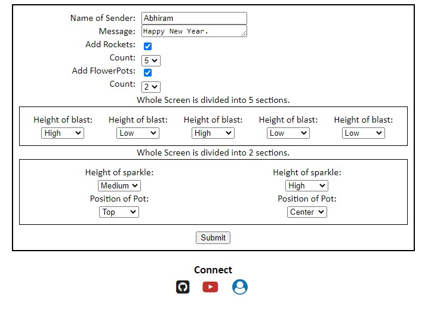
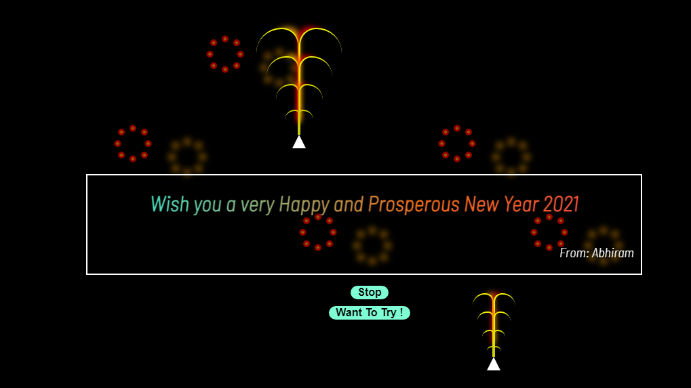

# Dynamic-Greetings
A simple Javascript Project, through which, we can share our greets to our dear ones !!.
***
## A Look !

***

***

## Features
* Online Greeting made effective.
* Super User Freiendly.
* Customizable designs.
* Main purpose is to greet Diwali wishes.
* No restrictions.
* Huge scope on future updates.
* Distinguish emoji and normal character
* Shorten URL and share your warm wishes.

## URL Shortener.
### Code Forked from "WebDevSimplified" and Used to my project "Dynamic-Greetings" for shortening the URL for an easy convey of greetings. [Project here.](https://github.com/Abhiramborige/Dynamic-Greetings/)

## API format: 
- GET root/.netlify/functions/server/ - health.
- GET root/.netlify/functions/server/:shortUrl - unique shortID for long URL.
- POST root/.netlify/functions/server/shortUrl - map each long URL to shortID.

### [Hosted in Netlify using this.](https://paulreaney.medium.com/deploy-express-js-on-netlify-91cfaea39591)