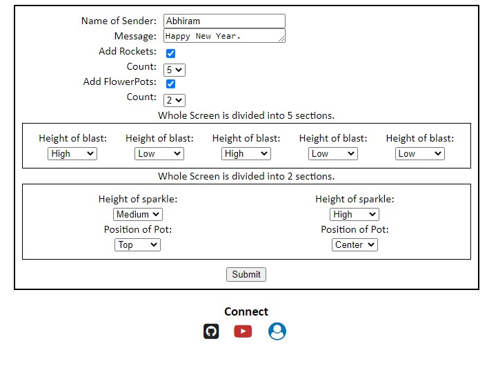
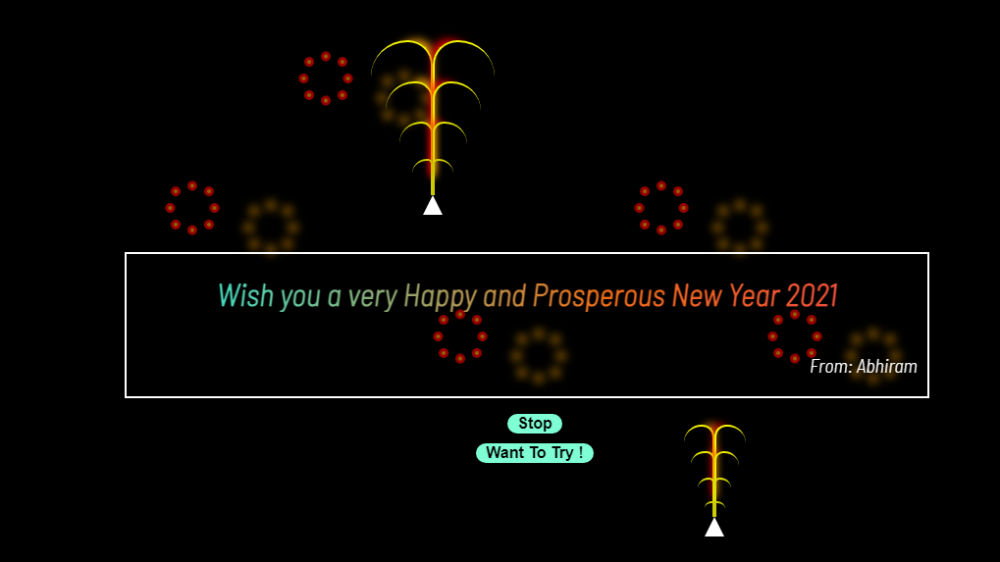

# Dynamic-Greetings
A simple Javascript Project, through which, we can share our greets to our dear ones !!.
***
## A Look !

## Features
* Online Greeting made effective.
* Super User Freiendly.
* Customizable designs.
* Main purpose is to greet Diwali wishes.
* No restrictions.
* Huge scope on future updates.
***

## Future Updates !
* Add some more designs and make them customizable.
* Implement a simple database using Firestore.
* Make the link shorter and distinguish each greet with a particular Unique ID.
* Improve User Experience
